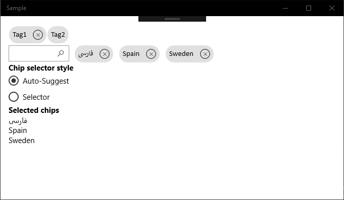
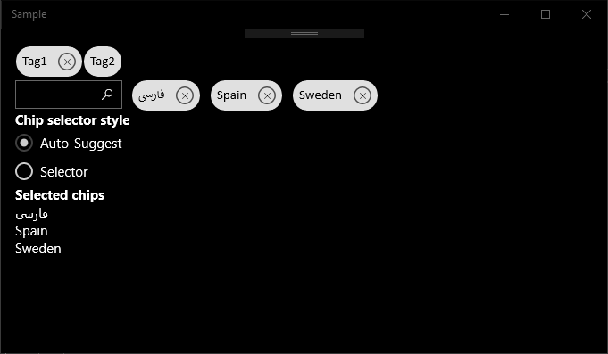

# UWP Chips Control





### Changes:
* No Border
* Set Proper BgColor
* Set Proper Paddings
* Set CornerRadius 
* Set Calibri FontFamily

Forked from: https://github.com/deanchalk/UWPChipsControl
---

## How to use in a UWP app
If you want to include this control in an app, you can look at the sample project for guidance, but essentially the control has the following bindable properties:

### SelectorStyle (`ChipsControl.ChipsSelectorStyle`)

This control include a selector for adding additional chips. There are 2 styles of selector - `AutoSuggest` and `Selector`

```csharp
ChipsSelectorStyle.AutoSuggest
```

The `AutoSuggest` selector style is based on the UWP AutoSuggest control, so as you type into the search box you will see a list of matches to the items in the `AvailableChips` property (see below). In addition you can simply type a new value. With the AutoSuggest selector style you can add new values that are not yet available.

```csharp
ChipsSelectorStyle.Selector
```

The `Selector` selector style is based on the UWP ComboBox control, so you have to select one of the existing items in the `AvailableChips` property (see below). 

### AvailableChips (`IEnumerable<string>`) 

This property is an enumerable of string values (`IEnumerable<string>`) that represents the options available when selecting a chip. the `Selector` selector style is limited to this list for selecting chips. The `AutoSuggest` selector style can select values from this list or type in a new value not already in `AvailableChips`

### SelectedChips (`IEnumerable<string>`) 

This property is an enumerable of string values (`IEnumerable<string>`) that represents the selected values (chips) from the control


